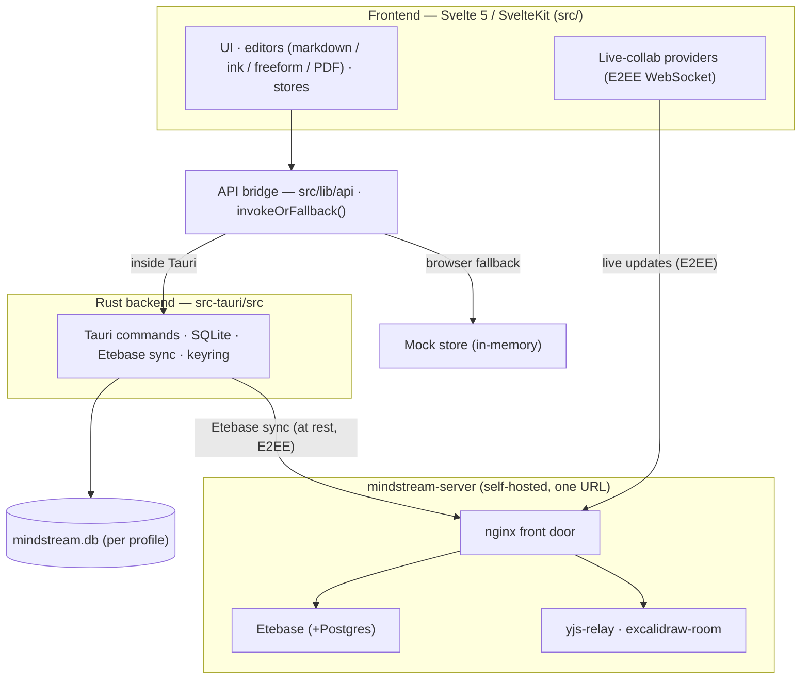

# Architecture

How Mindstream Notes fits together, end to end. For setup and builds see
[BUILDING.md](BUILDING.md); for the by-design trade-offs the sync/history model
carries see [known-limitations.md](known-limitations.md); for the
security issues still open against the design described here see
[security-review.md](security-review.md).

## The big ideas

- **Local-first.** The local SQLite database is the source of truth. The app is
  fully usable with no account; sync is additive, not required.
- **CRDT note bodies.** Every note body is a Yjs/yrs document, so concurrent
  edits (across devices, or live between peers) merge instead of clobbering.
- **Optional end-to-end-encrypted sync.** When signed in, the server only ever
  stores ciphertext — for at-rest sync (Etebase) and for live collaboration (a
  dumb relay that sees only AES-GCM frames).
- **Two run modes from one codebase.** Inside Tauri the UI calls real Rust
  commands; outside Tauri (`pnpm dev`, Playwright) the same calls fall back to an
  in-memory mock store, so the whole UI runs in a plain browser.

## Layers

## Frontend (`src/`)

Svelte 5 + SvelteKit render the UI. Editors are surface-specific: markdown uses
Milkdown/ProseMirror with `y-prosemirror`; ink is a Svelte canvas driven by
Pointer Events; freeform embeds an Excalidraw island; PDFs render through pdf.js.

- **API bridge — [`src/lib/api/`](../src/lib/api).** One thin module per Rust
  command surface (`notes.ts`, `collections.ts`, `sharing.ts`, …). Each call goes
  through `invokeOrFallback(command, args, fallback)` in
  [`api/core.ts`](../src/lib/api/core.ts): `isTauri()` checks for
  `__TAURI_INTERNALS__` on `window`; inside Tauri it `invoke()`s the Rust
  command, otherwise it runs the JS `fallback`. Outside Tauri the fallbacks read
  and write [`api/mock-store.ts`](../src/lib/api/mock-store.ts) — an in-memory
  store seeded with the same demo content Rust inserts on first run, so
  components can't tell the two modes apart. This dual mode is what lets the
  browser-fallback (T2) e2e tier drive the real UI without Rust or a database.
- **Stores — [`src/lib/stores/`](../src/lib/stores).** Svelte-runes state
  (`.svelte.ts`): the note tree, the active note source/status, the note-history
  bridge, profiles, signatures.
- **Live-collab providers — [`src/lib/sync/`](../src/lib/sync).**
  [`collab-provider.ts`](../src/lib/sync/collab-provider.ts) (markdown/PDF) and
  `ink-web-collab-provider.ts` speak a small binary WebSocket protocol to the
  relays. They AES-GCM-encrypt every Yjs update with a per-note key so the relay
  is a blind broadcast hub (frame = `[type][12-byte IV][ciphertext+tag]`); the
  room key is distributed through Etebase, which is already E2EE.

## The IPC boundary

The frontend never imports Rust directly — it `invoke()`s `#[tauri::command]`
functions. Errors flow back through `AppError`
([`src-tauri/src/error.rs`](../src-tauri/src/error.rs)), which maps Rust errors
to IPC error strings. All non-window state lives in SQLite; the frontend holds
only view state.

## Rust backend (`src-tauri/src/`)

One SQLite `Connection` sits behind a `Mutex` on the Tauri app state
([`db/mod.rs`](../src-tauri/src/db/mod.rs)); Tauri runs each command on its
thread pool, holding the lock only for a single query.

- **Persistence.** [`notes/`](../src-tauri/src/notes/mod.rs) (a `Note` =
  `NoteSummary` + body; soft-delete via `trashed_at`),
  [`collections/`](../src-tauri/src/collections/mod.rs) (folders),
  [`assets/`](../src-tauri/src/assets/mod.rs) (drawing image blobs, addressed as
  `mindstream-asset://<id>`), `signatures/`.
- **Note history — [`history/`](../src-tauri/src/history/mod.rs).** Point-in-time
  DEFLATE-compressed snapshots of a note's markdown in `note_versions`.
  Deliberately **local and never synced** — each device keeps its own timeline.
  A _restore_ is applied by the editor as a normal CRDT edit, so the restored
  content converges across devices through the ordinary sync path (replaying an
  old CRDT state blob would be a no-op).
- **Profiles / vaults — [`profiles.rs`](../src-tauri/src/profiles.rs).** Each
  profile is a self-contained directory `…/profiles/<id>/` with its own
  `mindstream.db`, Etebase session, settings, and backups. A `profiles.json`
  index at the fixed OS app-data root records which profile is active; boot
  reads it _before_ opening any database. A legacy single-vault layout is
  migrated into a `"default"` profile. The `MINDSTREAM_PROFILE_DIR` override
  (dev/e2e only) points the whole app at a throwaway dir — the isolation/restart
  seam the real-app tests use.
- **Auth — [`auth/mod.rs`](../src-tauri/src/auth/mod.rs).** Etebase login. The
  password is never stored: a random 32-byte key encrypts the saved account
  state; the **key** goes in the OS keystore (Credential Manager / Keychain /
  Secret Service) and the **encrypted blob** + username + server URL go in
  `etebase.session`. Both halves are required to unlock, so leaking the file
  alone yields nothing.
- **Search — [`search/mod.rs`](../src-tauri/src/search/mod.rs).** Rust free-text
  matcher: AND token semantics, score `+10` per title hit / `+1` per body hit,
  with snippet + highlight ranges. [`api/search-matcher.ts`](../src/lib/api/search-matcher.ts)
  mirrors it for the browser fallback (kept behaviourally aligned by tests).
- **Backup — [`backup.rs`](../src-tauri/src/backup.rs).** A zip of
  `manifest.json` (version, account identity via `etebase_collection_uid`,
  counts) + `data.db` (a `VACUUM INTO` snapshot). Import supports preview,
  staged-restart restore, and in-process merge.
- **Also here:** PDF annotate/export (`pdf_export.rs`, `pdf_text.rs`), vault
  export (`notes_export.rs`), the macOS native menu (`native_menu.rs`), tray,
  hotkeys, and desktop settings.

## The CRDT document model

A note body is a `yrs::Doc` with a single named `body` text field, wrapped by
[`sync/yrs_doc.rs`](../src-tauri/src/sync/yrs_doc.rs) so nothing else imports
`yrs`. The wire format is the **v1** update encoding to match what the JS editor
produces. Local edits arrive as "the editor saved a new full body"; Rust diffs
old vs new with `similar` and replays the inserts/deletes against the Y.Text, so
a concurrent offline insert on device A and delete on device B both survive the
merge. This encoded CRDT state is the source of truth that travels in sync.

## Sync

- **Vault sync — [`sync/mod.rs`](../src-tauri/src/sync/mod.rs).** Two Etebase
  collections back the local store: `mindstream.folders` (placement metadata) and
  `mindstream.notes` (a msgpack `NotePayload` carrying the yrs CRDT state plus
  parent/position/tags/trash). Each sync bootstraps the collections, then per
  kind pulls by `stoken` and pushes dirty rows via `ItemManager::transaction`
  (folders first, so notes can resolve their parent). On a `Conflict` it refetches
  the item, merges the remote CRDT state into the local one (or takes remote
  non-CRDT fields for metadata-only rows), and retries — optimistic concurrency
  with the CRDT doing the actual conflict-free merge.
- **Live collaboration.** For real-time co-editing, the frontend collab providers
  connect to the relays and exchange encrypted Yjs updates directly (above),
  separate from the at-rest Etebase sync.

## Collection sharing

Sharing a folder ([`sharing.rs`](../src-tauri/src/sharing.rs),
[`sync/scopes.rs`](../src-tauri/src/sync/scopes.rs)) creates a **scope**: one
`mindstream.share_manifest` collection (its content is the manifest JSON) plus
three part collections — folders / notes / assets. Sharing **re-homes** the
subtree: every folder/note/asset under the root is stamped with `share_scope_id`
and detached from the vault-wide collections, and `sync::scopes` then pushes and
pulls the scope's dedicated collections so a recipient receives the real content.
Items created or moved into a shared folder afterward inherit the scope
automatically. Because a row carries exactly one `share_scope_id` (or none), it
lives in exactly one collection — "one home". Incoming invitations are grouped
into manifest-backed **bundles** (one notification per share, not one per part
collection) that the recipient can accept or decline. Scoped sync is best-effort:
an error there is logged, never propagated, so a broken share can't wedge the
user's own vault sync.

## The backend stack

The optional server ([`backend/`](../backend/README.md)) is a Docker Compose
stack behind **one URL**: an `nginx` front door path-routes to **Etebase**
(encrypted storage + auth, on Postgres), **yjs-relay** (markdown/PDF live
collab), and **excalidraw-room** (freeform live collab). The client is
configured with just that URL and derives the collaboration WebSocket paths
itself. Operational details are in [backend/docs/advanced.md](../backend/docs/advanced.md).

## How this shapes testing

The layering maps directly onto the [test tiers](e2e/strategy.md): pure logic is
unit-tested (T1); the mock-store fallback lets Playwright exercise the whole UI
without a backend (T2); the real IPC + SQLite + restart path needs the packaged
binary (T3); and sync/sharing/live-collab convergence needs two real clients plus
the backend stack (T4). See [e2e-tests/README.md](../e2e-tests/README.md) to run
them.
